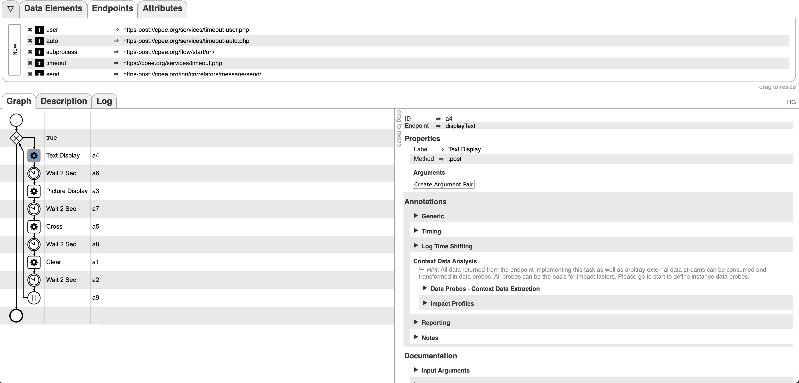

## Overview

The ePaper Display Controller is a comprehensive solution for controlling a 1.54-inch e-paper display using an ESP32 microcontroller. This system allows users to send commands over Wi-Fi to the ESP32 to display text, images, and patterns on the e-paper screen. This README document provides detailed information on setting up the system, including hardware connections, software libraries, installation, and usage instructions.

## Table of Contents

- [1. Features](#1-features)
- [2. Hardware Requirements](#2-hardware-requirements)
- [3. Software Requirements](#3-software-requirements)
- [4. Installation](#4-installation)
- [5. Hardware Setup](#5-hardware-setup)
- [6. Software Configuration](#6-software-configuration)
- [7. API Endpoints](#7-api-endpoints)
- [8. Usage](#8-usage)
- [9. Sample Outputs](#9-sample-outputs)


## 1. Features

- **Text Display:** Display custom text messages on the e-paper screen.
- **Image Display:** Showcase images or patterns on the display.
- **Cross Pattern:** Generate a cross pattern for testing or display purposes.
- **File Management:** Upload images and list files stored on the ESP32 filesystem.

## 2. Hardware Requirements

- ESP32 microcontroller
- 1.54-inch e-paper display (SPI interface)
- Jumper wires for connections

## 3. Software Requirements

- Arduino IDE or compatible ESP32 programming environment
- Required libraries:
  - GxEPD2 for e-paper control
  - ESPAsyncWebServer for handling web requests
  - LittleFS for file system operations
  - Fonts library (FreeMonoBold9pt7b, FreeMonoBold18pt7b, etc.)
- Python environment with the following packages for the server-side image processing:
  - Flask
  - Pillow
  - numpy
  - requests

The required Python packages are listed in the provided `requirements.txt` file.

## 4. Installation

To set up the ePaper Display Controller, follow these steps:

1. **Arduino IDE Setup:**
   - Install the Arduino IDE from the official website.
   - Add the ESP32 board to your Arduino IDE.
   - Install the following libraries through the Library Manager: `GxEPD2`, `ESPAsyncWebServer`, and `LittleFS`.

2. **Python Environment Setup:**
   - Ensure that Python is installed on your server.
   - Use the `requirements.txt` file to install the necessary Python packages with the command:
     ```
     pip install -r requirements.txt
     ```
  - Run the `image_processing_server.py` file on your server. This server processes images into a binary format suitable for the e-paper display and triggers an endpoint to update the display. The Python script must be running continuously on the server as it listens for incoming image processing requests and serves the processed images to the ESP32 for display.

## 5. Hardware Setup

Connect the e-paper display to the ESP32 according to the pin definitions in the provided code:

- `EPD_CS`: Pin 5
- `EPD_DC`: Pin 17
- `EPD_RST`: Pin 16
- `EPD_BUSY`: Pin 4
- `EPD_MOSI`: Pin 23
- `EPD_CLK`: Pin 18


Below are examples of GPIO connections that needs to be set. 
  
  
  
  

## 6. Software Configuration

Upload the `epaper_display_controller.ino` file to your ESP32 using the Arduino IDE. This script initializes the Wi-Fi connection and starts a web server with multiple endpoints to control the e-paper display.

## 7. API Endpoints

The system provides the following endpoints:

- `/clear`: Clears the e-paper display.
- `/displayText`: Displays the provided text on the e-paper.
- `/cross`: Displays a cross pattern on the e-paper.
- `/upload`: Handles file uploads to the ESP32 file system.
- `/process-image`: Convert any arbitrary size or tpye of image to bin format and triggers displayPicture() function inside the ESP32.
- `/list`: Lists the files stored on the ESP32.

## 8. Usage

After setting up the hardware and software as described in previous sections, you can interact with the ePaper Display Controller through a series of HTTP endpoints. Each endpoint performs a different function, such as displaying text or images, clearing the display, and managing files.

Here are some examples of how to use `curl` to interact with the device:

- **Clear the display**:
  ```
  curl -X GET http://<ESP32_IP>/clear
  ```

- **Display text**:
  ```
  curl -X POST -H "Content-Type: application/json" -d '{"text":"Hello World"}' http://<ESP32_IP>/displayText
  ```

- **Display cross pattern**:
  ```
  curl -X GET http://<ESP32_IP>/cross
  ```

- **Display an image**:
  ```
  curl -X POST -H "Content-Type: application/json" -d '{"url": "your-url"}' http://127.0.0.1:5000/downloadImage
  ```

- **List files**:
  ```
  curl -X GET http://<ESP32_IP>/list
  ```

Make sure to replace `<ESP32_IP>` with the actual IP address assigned to your ESP32 device. These commands can be run in any terminal that supports `curl` or integrated into any other HTTP client interface.


## 9. Sample Outputs

Below are examples of outputs that can be displayed on the e-paper screen using the provided endpoints:

- **Text Display Output (`/displayText` endpoint):** When a text display command is sent, the screen shows the text message. For example, "Hello World" is displayed.
  

- **Image Display Output (using `/upload` endpoint):** A bitmap image can be displayed on the screen, as demonstrated by the detailed image.
  

- **Cross Pattern Output (`/cross` endpoint):** The cross pattern, which is useful for testing the screen, is shown.
  

- **Clear Screen Output (`/clear` endpoint):** This command clears the display, resulting in a blank screen.
  

- **Sample CPEE Screen Output 
  
  
